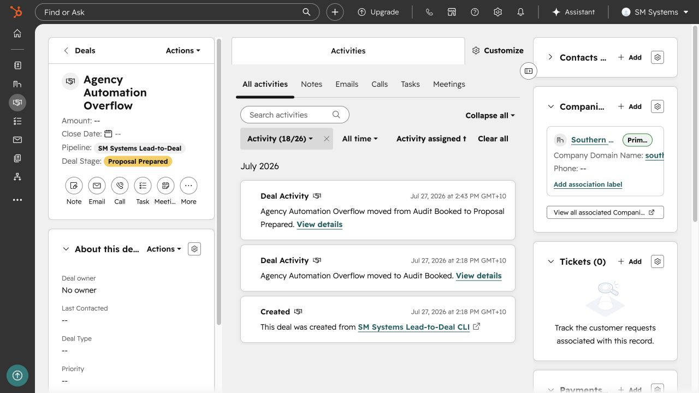
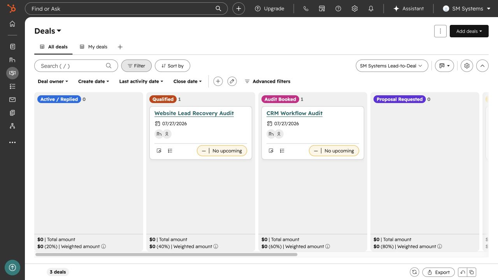
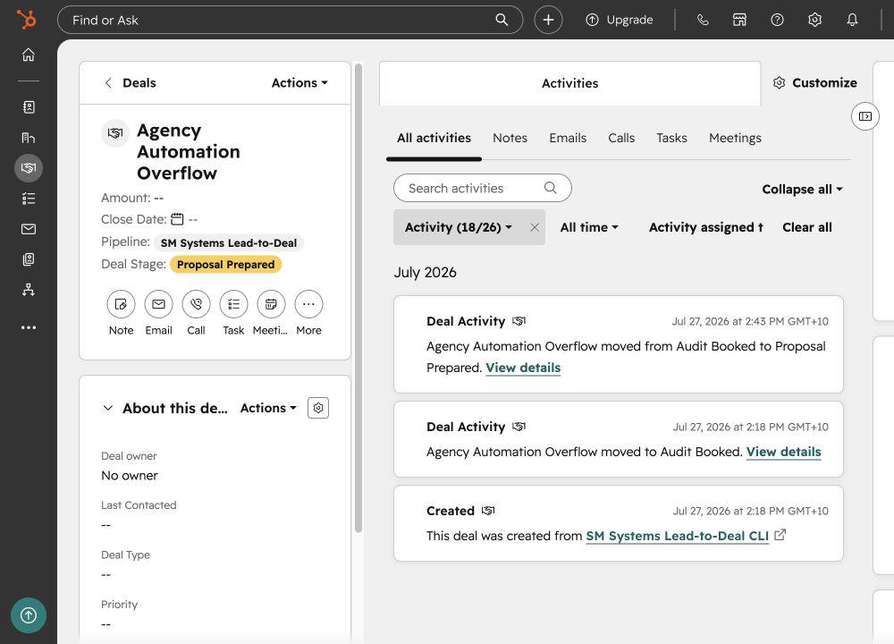

# HubSpot Lead-to-Deal CRM

A HubSpot implementation for controlled lead admission, linked company/contact/deal records and a seven-stage operating pipeline.

The design keeps early acquisition records outside HubSpot until there is a clear relationship to manage. Admitted records receive stable external keys so a repeated import matches the existing CRM object instead of creating another one.

| | |
| --- | --- |
| Status | Implemented and provider-validated |
| Role | CRM architecture, data contracts, pipeline configuration and lifecycle controls |
| Stack | HubSpot CRM, REST API, JSON contracts |
| Project page | [smsystems.au/work/hubspot-lead-to-deal-crm](https://smsystems.au/work/hubspot-lead-to-deal-crm/) |

## CRM model

```text
owner-approved lead
        │
        ▼
stable company, contact and deal keys
        │
        ├── company
        ├── contact
        └── deal
              │
              ▼
      native CRM associations
              │
              ▼
      seven-stage pipeline
```

Every admitted relationship is represented by three native CRM objects with explicit associations:

- company ↔ contact;
- company ↔ deal;
- contact ↔ deal.

The custom deal key remains stable across retries and can be used to reconcile an external operating system with HubSpot.



## Pipeline

| Stage | Purpose |
| --- | --- |
| Active / Replied | A real relationship has entered the CRM |
| Qualified | Scope and fit are sufficiently clear |
| Audit Booked | A discovery or audit session is scheduled |
| Proposal Requested | The client has asked for commercial scope |
| Proposal Prepared | Terms are ready for owner review |
| Won | Work has been accepted |
| Lost | The opportunity is closed without delivery |



## Lifecycle controls

Three controlled relationship sets were used to commission the object model and stage map. The provider readback confirmed all company, contact and deal associations. A second run matched every object through the stable keys.

The temporary commissioning records were then archived through an exact manifest, leaving the configured pipeline and deal-key property ready for real owner-approved relationships.



## Validate the public contracts

```bash
npm run validate
```

The validator checks stage order, unique object keys, complete association edges and idempotent rerun expectations.

## Repository contents

```text
assets/       selected HubSpot screens
contracts/    pipeline and association contracts
examples/     controlled CRM records and rerun state
scripts/      structural validator
docs/         data admission and cleanup design
```

[CRM architecture and lifecycle](docs/architecture.md)

